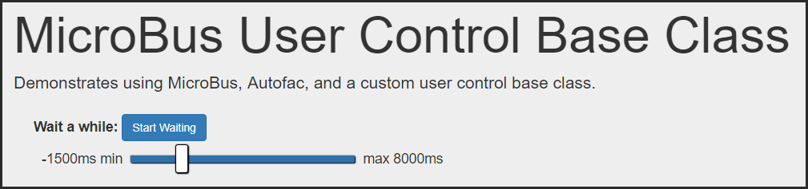

# About Events

This little project was an exploration on working with MicrBus & Autofac and integrating them with WebForms and User Controls. Part of the goal was to do a general approach to dealing with *Eventual Consistency* concerns by tracking when commands are completed and raising a UI event that a control can use for updating a page (aka: "faking" eventual consistency).

